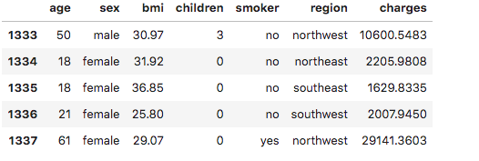
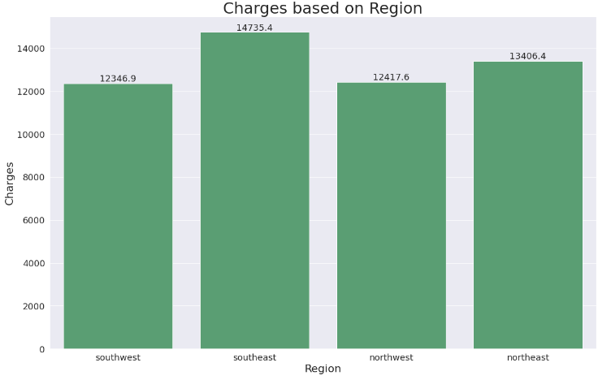
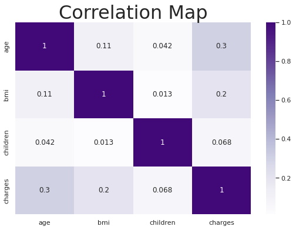
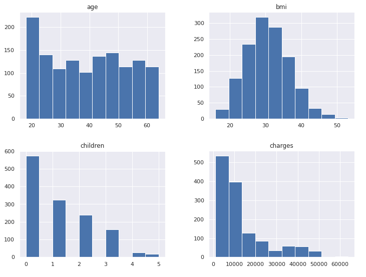
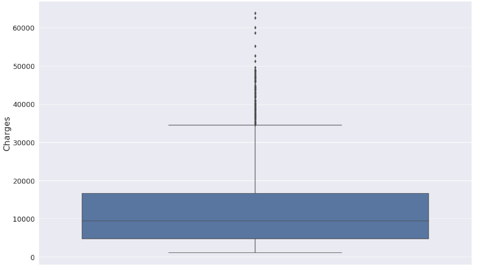
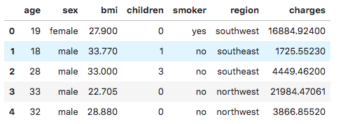
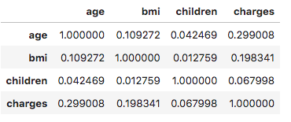

# Data Analysis Using Python
## Project Name: Insurance Companies

### Scatter Plot to Compare Average Rotten Tomato Rating Per Leading Studio

  

### Rotten Tomato Ratings on Histogram Plot

  

### Audience Score on Histogram Plot

  

### Number of Film Per Year on Bar Plot

  

### Audience Score Density

  

### Number of Film Per Genre on Histogram Plot

  

### Number of Film Per Genre on Histogram Plot

  

### Number of Film Per Studio on Bar Plot

  

### Number of Film Per Studio on Bar Plot

  

### Number of Film Per Studio on Bar Plot

  

